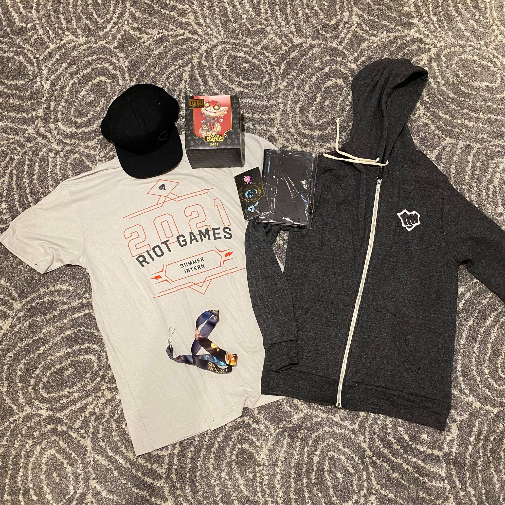
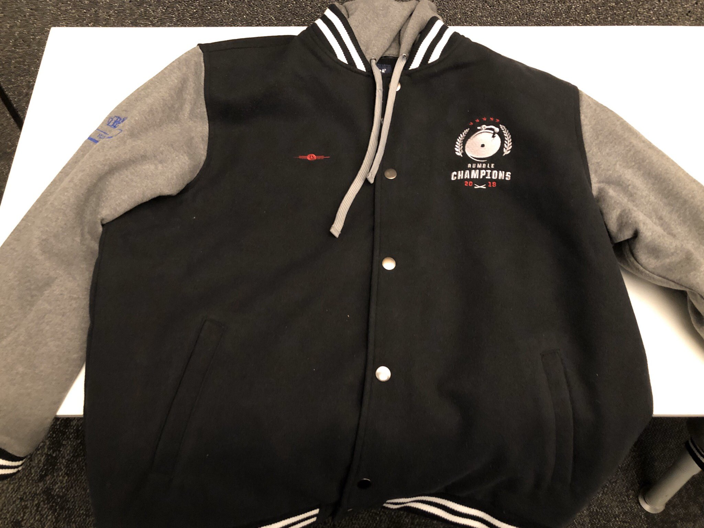
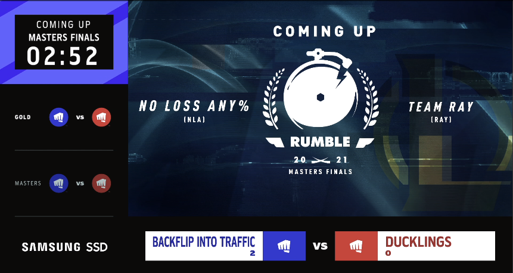

Hello 👋

In this post, I will be going through my internship experience, providing insight and tips for students that are interested in Riot Games! As a top level introduction, I was a software engineering intern on the social infrastructure team, providing game agnostic (Valorant, League of Legends, etc) features such as voice, chat, social graph.

Disclaimer: Unfortunately due to privacy concerns, while I am unable to go into the specifics of what I worked on, I will be able to provide key insight on the culture and life at riot during the pandemic.

### Applying to Riot Games

In this section, I will be highlighting the timeline from when I applied, to when I received the offer. My hope is that by providing this insight, students can get a rough estimate on the turnaround time and how you can time this with uOttawa’s internal coop navigator.

#### 09-17-2020:

Applied to Riot Games on their careers page [here](https://www.riotgames.com/en/work-with-us). I recommend applying as early as possible, as this will maximize your chances in aligning offers up with different companies. Note that Riot Games only offers summer internships. Depending on which coop stream you are following, be sure to plan ahead or make the relevant adjustments!

#### 10-04-2020:

Received Hackerrank coding challenge. Riot does things differently where it's not just a leetcode problem. What you will find is a multiple stage problem where code builds on top of each other. You will be implementing methods for a simple game, it will start off easy, but you will be calling the method you wrote in the first part later on. I love this approach :) I personally found it less stressful than your typical DP leetcode problem. I would recommend brushing up on your data structures and algorithms course and the significance of sets and hashmaps (when in doubt, throw a hashmap xD)

#### 10-05-2020:

Received an invitation to move forward to sync up for a 30 minute talk about my interest and experience and what I wanted to work on at Riot Games. This is also meant to ask any general questions about what the internship will be like. I recommend preparing a list of questions. These 30 minutes are for you to learn about the company (and for them to learn about you!) so be respectful and be curious! Also, be sure to read your resume and ensure that you are familiar with what you have written.

#### 10-15-2020:

Call date with a Riot Games Recruiter. For privacy reasons we will call him David. Prior to this call I was able to set up this time through calendly and provided my cell phone number. Don’t worry about international charges as they will be calling you. During this call, we discussed everything from my favourite league champion (looking at you Akali) to what Riot Games is looking for (eg: Mobile, front-end, backend, etc). As an example, David noticed that I had some mobile experience and if I was interested in working on Riot’s new mobile product. I conveyed that while it seemed interesting, I was looking for frontend or backend work to diversify my work experience. We then talked about more Riot related things like the culture, remote-work, mentorship, growth, etc. At the end of the call, David knew more about my work and what I wanted to get out of the internship. For myself, I got to learn more about the day to day of an intern and full-time employee at Riot Games.

#### 10-19-2020:

Received an invitation to move on to the next stage: CS fundamentals. I will be expected to discuss the results of the coding assessment, and be asked a couple questions related to data structures and algorithms (no leetcode). This call will be an hour long.

#### 10-23-2020:

Prior to this interview, I made sure to review the code I had written during the coding assessment. Particularly, I had a list of things I could have improved on and what impact it would have on performance and the developer experience. Additionally, I brushed up on data structures and algorithms, making sure to review trees and hashmaps. During the interview (Google meets), it went exactly how I expected it to go. By making the proper preparations, I was ready for almost any question about the code I wrote. I’d say the first 30 minutes were analyzing the code, and the last 30 minutes were about data structures.

At the end of the day, I actually received the invitation for the next step: Soft skills. This interview focuses more on soft skills, where I will be talking about my background, work history, and Riot. Once again this interview will be an hour long on Google meet.

#### 10-28-2020:

We are done with the technicals! Everything after here is how I can sell myself. For this interview, I made sure to review the core values found [here](https://www.riotgames.com/en/who-we-are/values). For each core value, I made sure that I had an example from my previous internships / school projects. I was asked general work questions like: Tell me about a time where you were stuck when solving a problem. I personally made a google doc and wrote down examples so that I wouldn’t need to think on the spot. I blanked out on a soft-skills interview before and wasn’t about to let that happen again!

#### 11-02-2020:

I received good news that I would be moving on to the final round: Hiring Manager. In this step, a hiring manager would have reviewed your profile and will declare interest in you. There will also be other potential candidates interviewing with the same hiring manager, so be sure to leave a good impression! I gave a list of potential dates and times (manual process rather than something automated like calendly).

#### 11-04-2020:

The day had arrived :) I had my 1:1 with the hiring manager with one goal in mind, to convey my passion and skills. As always, I like to prepare for things, so I did some extensive research on the social infrastructure team. In particular, I looked at the previous interns' blog posts and viewed a couple of articles on Riot’s tech blog. I also made a whole document on how I believed their services worked by providing a high level diagram.

The conversation itself was super fluid because I had things to talk about. I knew what the purpose of the team was and why the work would be interesting for myself. During this talk, I got to learn more about social infrastructure’s core services and how to interact with the game teams. Additionally, I was also asked questions on my previous internships /projects, times I failed, and times I succeeded.

#### 11-05-2020:

I received the offer letter 🎉 I was notified through email first if I was available, and was then announced through the call including the offer details, benefits, location, and stipend. (hint: I got lots of RP)

My interview experience with Riot Games has been extremely pleasant, and every point of contact was super friendly and wanted to see me succeed. If you ever feel unsure about what is to be asked during an interview, don't feel afraid to ask your university recruiter for some tips.

### Swag

Fun fact: all full time employees receive a teemo hat during their onboarding!

Here is a picture of all the swag I got from Riot! Unfortunately because of the pandemic, there were many delays in the swag package, so I was not able to receive it until the end of the internship.

My personal favourite is the riot jacket :) If only it had my summer name on the back 😔 (they used to do this before). The clothing quality isn’t the best, but it's going to be a good safekeep memory of the awesome internship I had. (I usually keep my company swag in a box, rather than wear it xD)

### Riot Rumble

During my time at Riot, there is a yearly tradition where rioters can compete in an internal tournament to obtain the coveted jacket.There are several divisions: bronze, silver, gold, platinum, diamond, and masters. Starting off with the group stage, you will be assigned 2-3 other teams during seeding in which you will play in groups in a bo3 match. The 1st and 2nd seed from each group will then be dropped into playoffs to win it all.

At the time, I barely touched ranked and had an unfortunate 30%~ win rate in silver flex. I was originally placed in the silver tier, but because I was previously diamond in s5, I asked the organizers to promote me to gold (gotta play fair!).

This was by far the most fun I have had as it allowed for me to network with Rioters outside of my team and discipline. I got to meet people that worked on valorant, production (media), and arts. It was fascinating to learn more about other Rioter’s work and would recommend joining in regardless of skill.

Also fun fact, but if you play in the finals you will be playing in the LCS studio! It was also amazing to see volunteer shoutcasters and having your friends and family watch you play :)

My team and I were pretty serious about winning, so we had a coach and did VOD reviews. I played in the bot lane and focused on hyper carries as the win condition. The strategy and playstyle ended up prevailing and we ended up going undefeated in the playoffs securing the coveted Riot rumble jacket!

You can watch the recording [here](https://www.twitch.tv/videos/1080905273) on twitch!

### A day in a life of a SWE intern

At Riot Games, interns aren’t just given a pet project, but rather fully integrated into the team. You get to work on what's needed now, and what will benefit the team in the long run. You get to work with your team, creating new relationships and sharing a wide variety of knowledge. As an aspiring software engineer, this is exactly what I am looking for. Real world experience. You will experience many of the daily and weekly rituals (standups, retrospectives, planning, etc).

Additionally, you will be assigned a mentor. I view the mentor as someone to guide you to success. They aren’t there to feed you answers, but give a sense of a general direction. Mentorship is extremely important because it allows you to grow in your field. Being able to learn about people’s mistakes and how they grew in the field will be crucial later on when you find yourself tracking the same steps.

So what does the work generally look like? From what I observed in the given year, there are 4 quarters and the product manager will prioritize what's best for the team. Each project will have developers and members will communicate together to ship products. Before joining in on a “big” project, I started off with onboarding tickets. These are great to get a general sense of what products are within the team’s portfolio. Additionally, you get to learn the language (if you are new at it) and most importantly you get to ask many questions. What patterns does this team use? Why do we test this way? Is there a reason why the file structure is like X? Be curious and ask questions.

After moving on from onboarding tickets, I got to work on something more chunkier. I got to work with another Software Engineer on the team and collaborate with the Tech Lead when discussing design and implementation details. Personally, I like to speak my approach and get confirmation on a general approach before jumping into coding. Discussion is good and generally catches errors and design flaws much sooner. Remember that a pair of fresh eyes can see what's in plain sight.

With that, I got to experience the development timeline of projects at Riot Games. I was able to understand what a full time employee would experience and what the growth looks like at Riot Games.

### Conclusion

At Riot Games, you will get to grow and impact millions of players from around the world. You will get to be part of a team and participate in an ambitious vision. You will get a chance to play like a pro, and create new relationships. Most importantly though, you will have tons and tons of fun.

Out of all my internships so far, Riot Games has hit all the bars and has defined to me a new expectation moving forward. Thank you to Riot Games, and I hope the insight I have shared sparks an interest for you to apply this year (or the future!)

Fistbumps,
Daniel Wu
